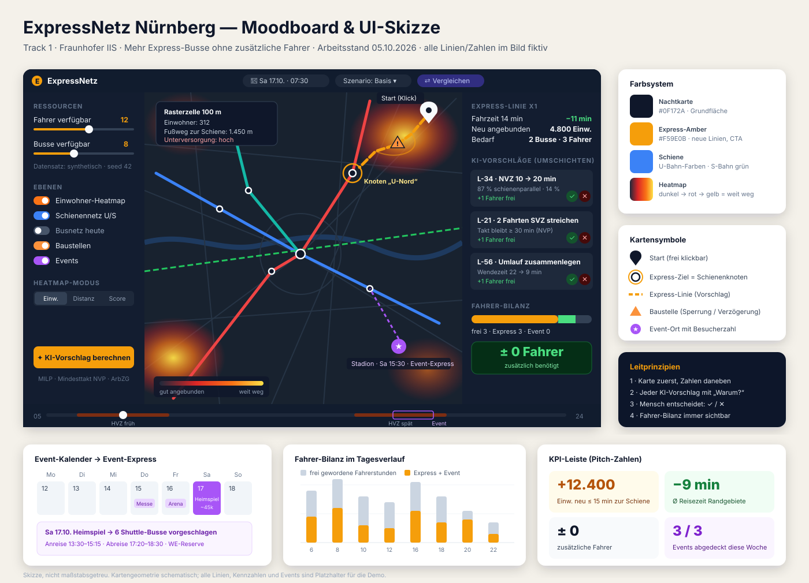
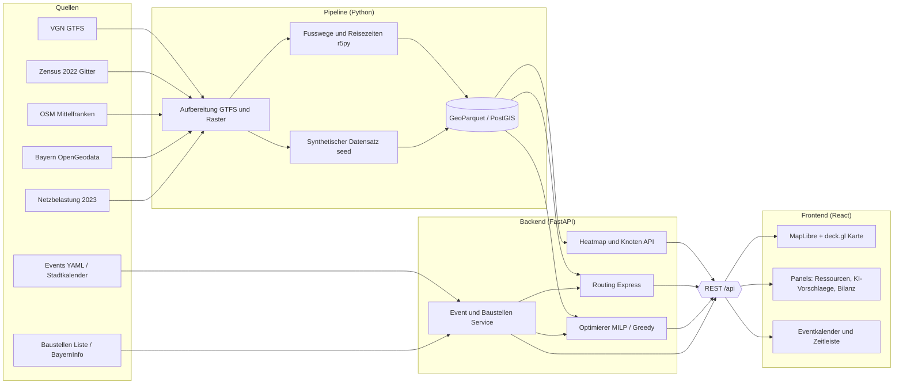
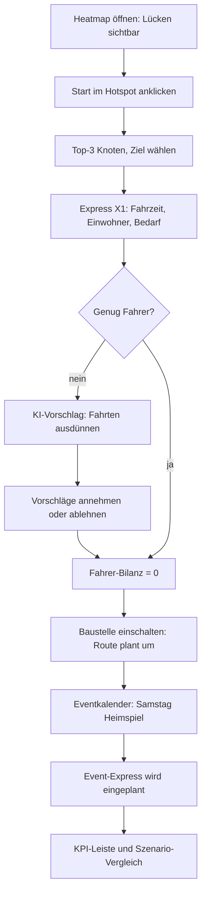

# ExpressNetz Nürnberg – Produktplan & Moodboard

> **Track 1 · Fraunhofer IIS** – KI-gestützte Planung von Express-Bussen in Nürnberg trotz Fahrermangel.
> Arbeitstitel „ExpressNetz“, Stand 05.10.2026. Dieses Dokument ist die gemeinsame Zielvorgabe fürs Team: **was** die Demo können soll, **womit** und **in welcher Reihenfolge**.



---

## 1. Kernidee in drei Sätzen

1. Eine **Heatmap** zeigt, wo viele Menschen weit von U-/S-Bahn entfernt wohnen.
2. Nutzer:innen ziehen von einem **frei wählbaren Startpunkt** eine **Express-Linie zu einem Schienenknoten**. Die KI rechnet, wie viele Busse und Fahrer:innen das kostet.
3. Diese Fahrer:innen holt die KI aus **schwach genutzten, schienenparallelen Fahrten**, plant **Event-Shuttles** mit ein und berücksichtigt **Baustellen**. Ziel: **± 0 zusätzliche Fahrer:innen**.

---

## 2. Feature-Übersicht

| # | Feature | Priorität | Kurz |
|---|---|---|---|
| F1 | Heatmap Bevölkerung × Distanz zur Schiene | **P1 – MVP** | Zensus-Raster + Verkehrsnetz, Unterversorgungs-Score |
| F2 | Express-Ziele = Schienenknoten | **P1 – MVP** | U-/S-Bahn-Knoten bewertet und als Ziel wählbar |
| F3 | Start frei auf Karte wählbar | **P1 – MVP** | Klick → Route → Fahrzeit, neu angebundene Einwohner |
| F4 | Ressourcen-Optionen (Fahrer, Busse) | **P1 – MVP** | Schieberegler + fiktiver Datensatz (Routen, Auslastung, Personal) |
| F5 | Bestehende Fahrten anpassen / KI-Vorschlag | **P1 – MVP** | Optimierer gibt Fahrer:innen frei, Fahrer-Bilanz |
| F6 | Event-Express mit Eventkalender | P2 – Ausbau | Großveranstaltung → Shuttle-Bedarf → Einsatzplan |
| F7 | Baustellen berücksichtigen | P2 – Ausbau | Sperrungen/Verzögerungen in Routing und Fahrzeiten |

**Querschnitt (alle Features):** Datum-/Uhrzeit-Auswahl, Szenarien speichern und vergleichen, KPI-Leiste, „Warum?“-Erklärung zu jedem KI-Vorschlag.

### 2.1 Gap-Analyse zur bestehenden Demo (bitte ausfüllen)

| # | In Demo vorhanden? | Was fehlt / was ändern | Verantwortlich |
|---|---|---|---|
| F1 | ☐ ja ☐ teilweise ☐ nein | | |
| F2 | ☐ ja ☐ teilweise ☐ nein | | |
| F3 | ☐ ja ☐ teilweise ☐ nein | | |
| F4 | ☐ ja ☐ teilweise ☐ nein | | |
| F5 | ☐ ja ☐ teilweise ☐ nein | | |
| F6 | ☐ ja ☐ teilweise ☐ nein | | |
| F7 | ☐ ja ☐ teilweise ☐ nein | | |

---

## 3. Features im Detail

### F1 – Heatmap: Geodaten + Verkehrsnetz + Einwohner

**User Story:** *Als Planer:in sehe ich auf einen Blick, wo viele Menschen weit vom Schienennetz entfernt wohnen.*

| | |
|---|---|
| **Daten** | Zensus 2022 100-m-Gitter (Einwohner), VGN-GTFS (Haltestellen, Linien), OSM-Fußwegenetz, Bayern OpenGeodata (Verwaltungsgrenzen, Nutzung) |
| **Berechnung** | pro Zelle: `fussweg_schiene_m` (kürzester Fußweg zur nächsten U-/S-Station, OSMnx/r5py) → `unterversorgung_score = einwohner × f(distanz) × f(reisezeit_hbf)` |
| **UI** | 3 Modi umschaltbar: **Einwohner**, **Distanz zur Schiene**, **Score**. Overlay: U-Bahn-Linien in Linienfarbe, S-Bahn gestrichelt, Busnetz optional. Tooltip pro Zelle. |
| **Kennzahl** | „X Einwohner wohnen > 800 m Fußweg von U-/S-Bahn“ |

**Akzeptanzkriterien**
- [ ] Raster für Nürnberg (+ Puffer zu Fürth/Erlangen) lädt in < 2 s
- [ ] Modus-Umschaltung ohne Neuladen
- [ ] Tooltip mit Einwohnern, Fußweg in m, Score-Klasse
- [ ] Schienennetz und Haltestellen als eigene, abschaltbare Ebene

---

### F2 – Ziel: Express-Haltestellen an Knotenpunkten

**User Story:** *Als Planer:in wähle ich als Ziel einer Express-Linie einen gut angebundenen Schienenknoten.*

| | |
|---|---|
| **Kandidaten** | alle Stationen mit `ist_schienenknoten = true` (U-Bahn und/oder S-Bahn) |
| **Knoten-Score** | Abfahrten/h, Anzahl Linien, Umstiegszeit, P+R vorhanden, barrierefrei (VAG OpenData) |
| **UI** | Knoten als Ringe, Größe = Score. Beim Setzen eines Starts werden die **3 besten erreichbaren Knoten** vorgeschlagen; manuelle Auswahl per Klick. |

**Akzeptanzkriterien**
- [ ] Knotenliste mit Score kommt aus der Pipeline (kein Hardcoding)
- [ ] Top-3-Vorschlag abhängig vom Startpunkt (Fahrzeit + Knoten-Score)

---

### F3 – Start flexibel auf der Karte wählbar

**User Story:** *Ich klicke irgendwo in ein unterversorgtes Gebiet und bekomme sofort eine Express-Linie zum Knoten.*

| | |
|---|---|
| **Interaktion** | Klick = Startpunkt · Ziel aus F2 · optionale Zwischenhalte per Drag auf der Route |
| **Auto-Vorschlag** | Button „Hotspots vorschlagen“: gewichtetes Clustering (k-means/DBSCAN, Gewicht = Score) → Startpunkte |
| **Routing** | Straßennetz OSM (OSRM oder OSMnx), Bus-Geschwindigkeitsprofil je Straßentyp |
| **Ergebnis** | Fahrzeit Express, **Zeitgewinn vs. heute** (r5py, Tür-zu-Tür), neu angebundene Einwohner (400 m um Express-Halte), Bedarf an Bussen/Fahrer:innen für gewählten Takt |

**Akzeptanzkriterien**
- [ ] Klick → Route + Kennzahlen in < 3 s
- [ ] Mehrere Express-Linien gleichzeitig (X1, X2 …), jede eigene Farbe/Karte im rechten Panel
- [ ] Takt wählbar (10 / 15 / 20 / 30 min) → Bus- und Fahrerbedarf aktualisiert sich

---

### F4 – Optionen: Anzahl Fahrer:innen + Busse, fiktiver Datensatz

**User Story:** *Ich stelle ein, wie viele Fahrer:innen und Busse heute verfügbar sind, und sehe, was damit möglich ist.*

Da keine internen VAG-Daten vorliegen, erzeugen wir einen **reproduzierbaren synthetischen Datensatz** (`seed`), der sich an GTFS-Fahrplan und Netzbelastung 2023 orientiert.

| Datei | Inhalt (Auszug) |
|---|---|
| `synthetic/busse.csv` | `bus_id, typ (Solo/Gelenk), plaetze, depot, verfuegbar_ab, verfuegbar_bis` |
| `synthetic/fahrer.csv` | `fahrer_id, depot, schicht (früh/spät/geteilt), dienstbeginn, dienstende, krank (bool)` |
| `synthetic/fahrten.csv` | `trip_id, linie, start, ende, fahrzeit_min, laenge_km, umlauf_id` (aus GTFS abgeleitet) |
| `synthetic/auslastung.csv` | `trip_id, stunde, fahrgaeste, max_besetzung, auslastung_pct` (Gravitationsmodell, kalibriert auf Netzbelastung 2023) |
| `synthetic/umlaeufe.csv` | `umlauf_id, fahrtenfolge, wendezeit_min, fahrer_id` |

**Generator:** `pipeline/40_synthetic.py --seed 42 --fahrer-ausfall 0.12 --busse-reserve 0.08`

**UI:** Schieberegler Fahrer und Busse · Anzeige der Datenquelle („synthetisch · seed 42“) · Preset-Szenarien: *Normaltag*, *Krankheitswelle −15 %*, *Event-Samstag*.

**Akzeptanzkriterien**
- [ ] Gleicher Seed → gleiche Daten
- [ ] Regler-Änderung löst Neuberechnung der Fahrer-Bilanz aus
- [ ] Synthetische Daten sind in der UI klar als solche gekennzeichnet

---

### F5 – Bestehende Fahrten anpassen / KI schlägt vor → Fahrer übrig

**User Story:** *Die KI zeigt mir, welche Fahrten ich ausdünnen kann, ohne Mindeststandards zu verletzen, und wie viele Fahrer:innen dadurch frei werden.*

**Spender-Score je Fahrt** (aus Datenmodell): niedrige Auslastung + hoher Anteil schienenparallel + Takt über Mindeststandard (Nahverkehrsplan 2025).

**Optimierung (MILP, OR-Tools/PuLP)**
- Entscheidungsvariablen: `x_t ∈ {0,1}` Fahrt *t* bleibt · `y_e` Anzahl Umläufe auf Express-Linie *e*
- Nebenbedingungen:
  - Mindesttakt je Linie und Zeitfenster bleibt erhalten (NVP-Standard)
  - Fahrer-Stunden: freigewordene ≥ benötigte (Express + Event)
  - Busse gleichzeitig ≤ verfügbare Busse
  - Dienste regelkonform (ArbZG/FPersV: Schichtlänge, Pausen)
- Zielfunktion: `max Nutzen(Express) − Verlust(ausgedünnte Fahrten)`, Verlust ≈ betroffene Fahrgäste × Zusatzwartezeit
- Fallback für die Demo: **Greedy nach Spender-Score**, falls der Solver zu langsam ist

**UI (rechtes Panel)**
- Vorschlagskarten: „L-34 · NVZ 10 → 20 min · +1 Fahrer“ mit **✓ annehmen / ✕ ablehnen**
- „Warum?“ aufklappbar: Auslastung, Schienenparallelität, verbleibender Takt
- Manuelle Anpassung: Takt einer Linie per Dropdown ändern
- **Fahrer-Bilanz** dauerhaft sichtbar: frei · Express · Event · **übrig/fehlend**

**Akzeptanzkriterien**
- [ ] Kein Vorschlag verletzt Mindesttakt (automatischer Check + rote Warnung bei manueller Verletzung)
- [ ] Bilanz aktualisiert sich bei jedem ✓/✕
- [ ] Ergebnis exportierbar (CSV/JSON) als „Szenario“

---

### F6 – Event-Express bei Veranstaltungen (Eventkalender)

**User Story:** *Bei einer Großveranstaltung schlägt das System automatisch Shuttle-Busse von unterversorgten Gebieten bzw. Knoten zum Veranstaltungsort vor.*

| | |
|---|---|
| **Eventquellen** | 1) kuratierte `events.yaml` mit großen Venues (Stadion, Arena, Messe, Volksfestplatz, Zeppelinfeld, Hauptmarkt) · 2) optional Veranstaltungskalender der Stadt Nürnberg (Export-Schnittstelle für Partner → Zugang anfragen) |
| **Felder** | `event_id, name, venue, geom, beginn, ende, besucher_erwartet, kategorie` |
| **Bedarfsmodell** | `busse = ceil(besucher × oev_anteil × anteil_express / (plaetze × umlaeufe_im_fenster))` – alle Anteile als Parameter (Annahmen kennzeichnen) |
| **Zeitfenster** | Anreise ca. 2 h vor Beginn, Abreise-Spitze direkt nach Ende |
| **Personal** | Events liegen oft abends/am Wochenende → Fahrer:innen aus Zeiten mit geringerer Nachfrage, Verrechnung in der Fahrer-Bilanz (F5) |
| **UI** | Kalender-Leiste (Woche), Event-Pins auf der Karte, Klick → Event-Express-Vorschlag mit Shuttle-Anzahl und Zeiten |

**Akzeptanzkriterien**
- [ ] Event im Kalender anklicken → Shuttle-Route(n) + Bus-/Fahrerbedarf
- [ ] Event-Bedarf fließt in den Optimierer (F5) ein
- [ ] Mind. 3 Beispielevents in der Demo (z. B. Heimspiel, Messe, Konzert)

---

### F7 – Baustellen mitdenken

**User Story:** *Baustellen verändern Fahrzeiten und Routen; Express-Vorschläge umfahren gesperrte Abschnitte.*

| | |
|---|---|
| **Quellen** | Stadt Nürnberg „Alle Baustellen im Stadtgebiet“ (Liste: Straße, Zeitraum, Art – kein Download → scrapen + geocodieren) · BayernInfo / Baustellenmeldungen Bayern (DATEX II, eher übergeordnete Straßen) · VGN/VAG Fahrplanänderungen · für die Demo zusätzlich `baustellen_fiktiv.geojson` |
| **Felder** | `baustelle_id, geom (Linie/Punkt), von, bis, art, wirkung (sperrung / einspurig / verzoegerung_pct)` |
| **Wirkung** | Routing: gesperrte Kanten entfernen, sonst Fahrzeitzuschlag · bestehende Linien im 50-m-Puffer markieren → Verspätungsrisiko · nur aktiv im gewählten Datum |
| **UI** | Ebene „Baustellen“ (orange Dreiecke), Tooltip mit Zeitraum, Hinweis in betroffenen Express-/Linienkarten, Umleitung als Alternativroute |

**Akzeptanzkriterien**
- [ ] Datum ändern → Baustellen erscheinen/verschwinden
- [ ] Express-Route wird bei Sperrung automatisch umgeplant, Fahrzeit-Differenz sichtbar

---

## 4. Architektur (Vorschlag – an bestehende Demo anpassen)



| Schicht | Vorschlag | Warum |
|---|---|---|
| Daten-Pipeline | Python, GeoPandas, gtfs-kit, OSMnx, r5py | offene Daten, schnell reproduzierbar |
| Speicherung | GeoParquet (Hackathon) → PostGIS (später) | kein DB-Setup nötig für die Demo |
| Optimierung | OR-Tools / PuLP, Greedy-Fallback | MILP erklärbar, Fallback für Live-Demo |
| Backend | FastAPI | schnell, typisiert, Python-Stack |
| Frontend | React + MapLibre GL + deck.gl (`H3HexagonLayer` / `GridLayer`, `PathLayer`) | performante Heatmaps, dunkler Kartenstil |

### API-Skizze

| Methode | Endpoint | Zweck |
|---|---|---|
| GET | `/api/grid?mode=einwohner\|distanz\|score&bbox=` | Heatmap-Zellen (F1) |
| GET | `/api/network` | U-/S-Bahn, Busnetz (F1) |
| GET | `/api/hubs?start=lat,lon` | Knoten + Top-3 für Start (F2) |
| POST | `/api/express/route` | `{start, hub, waypoints, takt, datum}` → Route, Fahrzeit, Einwohner, Bedarf (F3, F7) |
| GET/PUT | `/api/scenario` | Fahrer, Busse, Seed, angenommene Vorschläge (F4) |
| POST | `/api/optimize` | `{fahrer, busse, datum, express[], events:true, baustellen:true}` → Vorschläge + Bilanz (F5) |
| GET | `/api/events?from=&to=` · POST `/api/events/{id}/plan` | Eventkalender + Shuttle-Plan (F6) |
| GET | `/api/baustellen?datum=` | aktive Baustellen (F7) |

---

## 5. Nutzerfluss in der Demo



### Pitch-Story (ca. 3 Minuten)
1. **Problem:** Heatmap → „In diesen Randgebieten wohnen X Menschen > 800 m von der Schiene.“
2. **Idee:** Klick in den Hotspot → Express X1 zum Knoten, **−11 min** Reisezeit.
3. **Engpass:** Regler auf realistische Fahrerzahl → Bilanz rot.
4. **KI:** „Vorschlag berechnen“ → 3 schienenparallele, schwach genutzte Fahrten → Bilanz **± 0**.
5. **Realität:** Baustelle → Umplanung; Heimspiel am Samstag → Shuttles automatisch eingeplant.
6. **Ergebnis:** KPI-Leiste: neu angebundene Einwohner, Minuten gespart, 0 zusätzliche Fahrer:innen.

---

## 6. Design-Leitlinien (Moodboard)

- **Karte zuerst:** dunkle Basiskarte, Daten leuchten darauf. Seitenpanels links (Eingaben) und rechts (Ergebnisse), Zeitleiste unten.
- **Farben:** Nachtkarte `#0F172A` · Express-Amber `#F59E0B` (alles Neue + CTA) · U-Bahn-Linienfarben · S-Bahn grün gestrichelt · Heatmap dunkel→rot→gelb · Baustelle `#FB923C` · Event `#A855F7` · positiv `#4ADE80`.
- **Erklärbarkeit:** jeder KI-Vorschlag mit „Warum?“, Mensch entscheidet per ✓/✕.
- **Ehrlichkeit:** synthetische Daten und Annahmen sind in der UI gekennzeichnet.
- **Fahrer-Bilanz** ist das wichtigste Element und immer sichtbar.

---

## 7. Repo-Struktur (Vorschlag)

```
expressnetz/
├── PLAN.md                  ← dieses Dokument
├── docs/
│   ├── moodboard.svg
│   ├── datenmodell.md
│   └── datenquellen.md
├── data/
│   ├── raw/                 ← Downloads (gitignored)
│   ├── processed/           ← GeoParquet aus der Pipeline
│   └── synthetic/           ← busse, fahrer, auslastung, events, baustellen
├── pipeline/
│   ├── 10_gtfs.py
│   ├── 20_grid_population.py
│   ├── 30_walk_traveltimes.py
│   ├── 40_synthetic.py
│   └── rules.yaml           ← Mindesttakt, Fußweg-Grenzen, ArbZG
├── backend/                 ← FastAPI (routing, optimize, events, baustellen)
└── frontend/                ← React + MapLibre + deck.gl
```

---

## 8. Arbeitspakete & Rollen

| Rolle | Verantwortet | Erste Schritte |
|---|---|---|
| **Daten & Geo** | F1, F2, Datenpipeline | GTFS + Zensus laden, Fußwege zur Schiene, Knoten-Score |
| **KI & Optimierung** | F4, F5, F6-Bedarfsmodell | synthetischer Generator, Spender-Score, Greedy → MILP |
| **Frontend & Karte** | F1–F3 UI, Panels, Kalender | Kartenbasis + Heatmap-Layer, Klick-Start, rechte Panels |
| **Pitch & Szenarien** | F6/F7-Daten, Demo-Story | `events.yaml`, Baustellen-GeoJSON, Pitch-Folien, KPI-Texte |

### Phasen
| Phase | Ziel | Fertig, wenn … |
|---|---|---|
| 0 · Setup | Repo, Stack, Daten-Downloads | alle können lokal starten |
| 1 · MVP | F1–F5 durchgängig | Pitch-Schritte 1–4 laufen live |
| 2 · Ausbau | F6 + F7 | Pitch-Schritt 5 läuft |
| 3 · Feinschliff | KPI-Leiste, Szenario-Vergleich, Probedurchlauf | 3-min-Demo ohne Fehler |

---

## 9. Backlog als GitHub-Issues

**Labels:** `F1-heatmap` `F2-knoten` `F3-start` `F4-ressourcen` `F5-optimierer` `F6-events` `F7-baustellen` `frontend` `backend` `data` `pitch`

- [ ] `data` GTFS laden, Stationen gruppieren, `ist_schienenknoten` ableiten
- [ ] `data` Zensus-100-m-Raster für Nürnberg + Puffer zuschneiden
- [ ] `data` Fußweg jeder Zelle zur nächsten U-/S-Station (OSMnx/r5py)
- [ ] `data` Unterversorgungs-Score + Export GeoParquet
- [ ] `frontend` Kartenbasis (dunkel) + Heatmap-Layer mit 3 Modi
- [ ] `frontend` Schienennetz-Layer + Tooltips
- [ ] `backend` `/api/hubs` mit Knoten-Score und Top-3
- [ ] `backend` `/api/express/route` (OSM-Routing, Fahrzeit, Einwohner im Einzugsbereich)
- [ ] `frontend` Klick-Start, Zielwahl, Express-Karten im rechten Panel
- [ ] `data` Generator `40_synthetic.py` (Busse, Fahrer, Auslastung, Umläufe; Seed)
- [ ] `frontend` Regler Fahrer/Busse + Preset-Szenarien
- [ ] `backend` Spender-Score + Greedy-Optimierer
- [ ] `backend` MILP mit Mindesttakt + Dienstregeln
- [ ] `frontend` Vorschlagskarten ✓/✕ + „Warum?“ + Fahrer-Bilanz
- [ ] `pitch` `events.yaml` mit ≥ 3 Events (Venue, Zeit, Besucher)
- [ ] `backend` Event-Bedarfsmodell + Einbindung in Optimierer
- [ ] `frontend` Eventkalender-Leiste + Event-Pins
- [ ] `data` Baustellen: Stadt-Liste scrapen + geocodieren, Fallback fiktives GeoJSON
- [ ] `backend` Routing mit Sperrungen/Zuschlägen, datumsabhängig
- [ ] `frontend` Baustellen-Layer + Umleitungshinweis
- [ ] `frontend` KPI-Leiste + Szenario speichern/vergleichen
- [ ] `pitch` Demo-Skript + Probedurchlauf

---

## 10. Offene Fragen

- Welche Teile der bestehenden Demo übernehmen wir (Stack, Karte, Daten)? → Gap-Analyse 2.1
- Fraunhofer IIS / VAG: gibt es echte Auslastungsdaten (APC) oder Fahrerzahlen-Größenordnungen zur Plausibilisierung?
- Zugang zur Export-Schnittstelle des städtischen Veranstaltungskalenders möglich, oder reicht die kuratierte Liste?
- Mindesttakt-Regeln: reichen die NVP-2025-Standards als harte Grenze, oder wollen wir sie als Schieberegler?
- Wie weit darf ein Express-Bus fahren (nur Nürnberg oder auch Fürth/Erlangen)?

---

## Quellen (Auswahl, Details in `docs/datenquellen.md`)

- VGN GTFS: https://www.vgn.de/opendata/GTFS.zip (CC BY 3.0 DE)
- Zensus 2022 Gitterdaten: https://www.destatis.de/static/DE/zensus/gitterdaten/Zensus2022_Bevoelkerungszahl.zip
- VAG OpenData: https://opendata.vag.de
- Netzbelastung 2023: https://www.nuernberg.de/imperia/md/verkehrsplanung/dokumente/netzbelastungsplane_2023_nurnberg.pdf
- Nahverkehrsplan 2025: https://www.nuernberg.de/imperia/md/verkehrsplanung/dokumente/nahverkehrsplan_2025_stadt_nurnberg.pdf
- Veranstaltungskalender Nürnberg / Datenbank: https://www.nuernberg.de/internet/veranstaltungskalender/veranstaltungsdatenbank.html · Exportschnittstelle: https://meine-veranstaltungen.net/dokus/Exportschnittstelle
- Baustellen Stadt Nürnberg: https://www.nuernberg.de/internet/soer_nbg/alle_baustellen.html · Karte BayernInfo: https://www.bayerninfo.de/inbound/nuernberg
- Baustellenmeldungen in Bayern (GovData): https://www.govdata.de/suche/daten/baustellenmeldungen-in-bayern
- VGN Fahrplanänderungen: https://www.vgn.de/fahrplanaenderungen/
