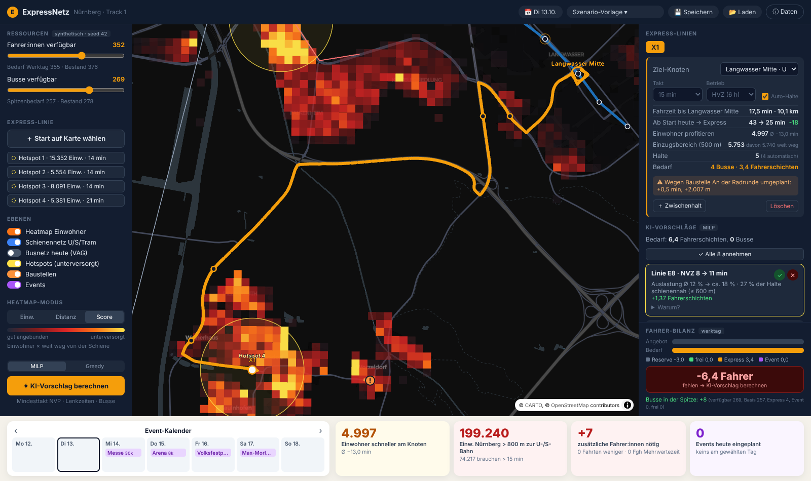
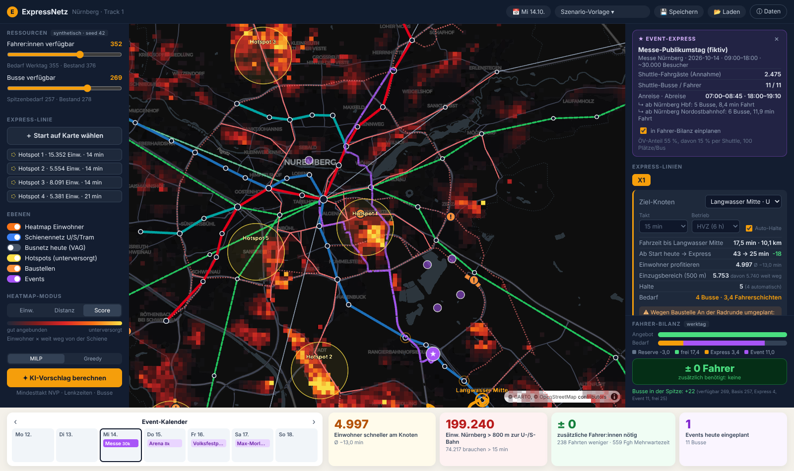
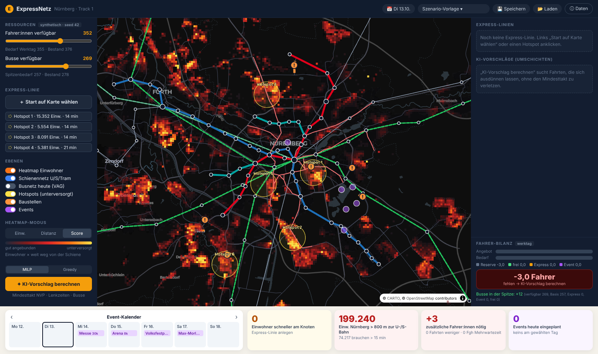

# ExpressNetz Nürnberg – Demo v0.1

> **Hackathon Track 1 · Fraunhofer IIS** – mehr Express-Busse in Nürnberg, ohne zusätzliche Fahrer:innen.
> Die Demo zeigt, wo Menschen weit vom Schienennetz wohnen, plant Express-Linien zu U-/S-Bahn-Knoten und spielt die nötigen Fahrer:innen per Optimierung aus schwach genutzten Fahrten frei – inklusive Events und Baustellen.



 

Zielbild und Feature-Beschreibung: [`PLAN.md`](PLAN.md) · Moodboard: [`docs/moodboard.svg`](docs/moodboard.svg)

---

## Schnellstart

Voraussetzungen: Python ≥ 3.10, Node ≥ 18.

```bash
./start.sh            # legt .venv an, baut das Frontend, startet alles
# → http://localhost:8000
```

Manuell / Entwicklung (zwei Terminals, Frontend mit Hot-Reload):

```bash
# Terminal 1 – Backend
python3 -m venv .venv && source .venv/bin/activate
pip install -r backend/requirements.txt
cd backend && uvicorn app.main:app --reload --port 8000

# Terminal 2 – Frontend
cd frontend && npm install && npm run dev   # → http://localhost:5173 (API wird an :8000 weitergeleitet)
```

Die aufbereiteten Daten liegen bereits in `data/processed` und `data/synthetic`. Die Pipeline muss nur laufen, wenn ihr Daten oder Regeln ändert (siehe unten).

Tests: `cd backend && python -m pytest -q`

---

## Was die Demo kann

| # | Feature | Stand | Umsetzung in v0.1 |
|---|---|---|---|
| F1 | Heatmap Einwohner × Schienennetz | ✅ | Zensus-2022-100-m-Raster (echt), 3 Modi: Einwohner / Fußweg zur U-/S-Bahn / Unterversorgungs-Score; U-Bahn, S-Bahn, Tram, Regionalbahn aus VGN-GTFS; Tooltip je Zelle |
| F2 | Express-Ziele = Knotenpunkte | ✅ | Knoten-Score je Schienenstation (Abfahrten/h, Linien, U+S-Verknüpfung); Top-3-Vorschlag je Startpunkt, im Panel umschaltbar |
| F3 | Start frei wählbar | ✅ | Klick in die Karte oder auf einen Hotspot → Route auf echtem OSM-Straßennetz, automatische Zwischenhalte, eigene Zwischenhalte per Klick, Takt 10/15/20/30, Betrieb HVZ oder 6–20 Uhr; Wirkung: Einwohner im Einzugsbereich, Zeitgewinn bis zum Knoten |
| F4 | Fahrer & Busse als Optionen | ✅ | Schieberegler; synthetischer Datensatz (Seed) aus echtem Fahrplan: Auslastung je Fahrt, Umläufe, Fahrer- und Busbestand; Vorlagen „Krankheitswelle“, „Messe-Mittwoch“, „Heimspiel-Samstag“ |
| F5 | Fahrten anpassen / KI-Vorschlag | ✅ | 125 Kandidaten-Maßnahmen (Takt ×1,5 oder ×2 je Linie und Zeitfenster), nur wenn der Mindesttakt (NVP 2025, vereinfacht) eingehalten wird und die Restfahrten nicht überfüllt sind; MILP (PuLP/CBC) oder Greedy minimiert die Mehrwartezeit; ✓/✕ je Vorschlag mit „Warum?“; Fahrer- und Bus-Bilanz live |
| F6 | Event-Express + Kalender | ✅ | Wochenkalender, 6 fiktive Events an echten Orten; Shuttle-Bedarf aus Besucherzahl, Routen von großen Knoten, An-/Abreisefenster; fließt in die Bilanz ein |
| F7 | Baustellen | ✅ | 8 fiktive Baustellen auf echten Straßen mit Zeitraum; Datum wechseln → Sperrungen werden umfahren, Verzögerungen verlängern die Fahrzeit, Hinweis im Panel |
| – | Szenarien | 🟡 | Speichern/Laden (JSON im Backend); Vergleichsansicht folgt |

### Demo-Ablauf (≈ 3 min Pitch)
1. **Heatmap „Score“**: die gelb/orangen Flächen sind dicht bewohnt und weit weg von der Schiene. KPI unten: Einwohner > 800 m zur U-/S-Bahn.
2. **Hotspot 4** links anklicken → Express X1 zur U-Bahn Langwasser Mitte, Reisezeit ab Start z. B. 43 → 25 min. Die Route umfährt automatisch eine Baustelle.
3. **Fahrer-Bilanz** ist rot (heute schon knapp + Express-Bedarf) → **„KI-Vorschlag berechnen“** → schienenparallele, schwach ausgelastete Fahrten werden ausgedünnt, Bilanz **± 0**.
4. Einen Vorschlag mit ✕ ablehnen, neu rechnen → Alternative.
5. **Kalender: Mi Messe** → Event-Express mit Shuttle-Bussen, Bilanz kippt → erneut optimieren.
6. **Sa Heimspiel** → am Wochenende ist mehr Reserve da, Shuttles sind ohne Ausdünnung möglich.

---

## Aufbau

```
expressnetz/
├── pipeline/            Datenaufbereitung (Python)
│   ├── 10_gtfs.py         Stationen, Schienenknoten, Linienverläufe, VAG-Stadtbusfahrten am Stichtag
│   ├── 20_grid.py         Zensus-Raster: Fußweg/Zeit zur Schiene, Score, Hotspots
│   ├── 30_roads.py        OSM-Straßennetz für Bus-Routing
│   ├── 40_synthetic.py    Auslastung, Umläufe, Busse, Fahrer, Events, Baustellen (Seed)
│   ├── rules.yaml         alle Annahmen: Mindesttakt, Geschwindigkeiten, Schichtlänge, Event-Anteile …
│   └── run_all.sh         Downloads + komplette Pipeline
├── backend/app/         FastAPI
│   ├── main.py            Endpunkte, liefert auch das gebaute Frontend aus
│   ├── routing.py         Dijkstra auf dem Straßengraphen inkl. Baustellen
│   ├── express.py         Knotenvorschläge, Express-Bewertung
│   ├── optimizer.py       Maßnahmen, Bilanz, MILP/Greedy
│   └── events.py          Event-Shuttle-Planung
├── frontend/src/        React + MapLibre + deck.gl
├── data/processed/      aufbereitete echte Daten (im Repo)
├── data/synthetic/      fiktive Daten (im Repo)
└── docs/                Moodboard, Datenmodell, Datenquellen, Screenshots
```

### API (Auszug)
| Methode | Endpoint | Zweck |
|---|---|---|
| GET | `/api/meta` | Baseline, KPIs, Regeln, Quellen |
| GET | `/api/grid` · `/api/network` · `/api/hotspots` | Heatmap, Schienen-/Busnetz, Hotspots |
| GET | `/api/hubs?lon=&lat=` | Top-3-Knoten für einen Startpunkt |
| POST | `/api/express/route` | Express-Linie bewerten (Route, Halte, Wirkung, Bedarf) |
| POST | `/api/bilanz` · `/api/optimize` | Fahrer-/Bus-Bilanz, KI-Vorschlag |
| GET/POST | `/api/events` · `/api/events/{id}/plan` | Eventkalender, Shuttle-Plan |
| GET | `/api/baustellen?datum=` | aktive Baustellen |
| GET/POST | `/api/scenarios` | Szenarien |

Interaktive Doku: http://localhost:8000/docs

---

## Daten & Annahmen

**Echt (offene Daten):**
- VGN GTFS Soll-Fahrplan, Stichtag Di 13.10.2026 – 48 VAG-Stadtbuslinien, 4.672 Fahrten, 101 Schienenstationen (CC BY 3.0 DE)
- Zensus 2022, 100-m-Gitter – ca. 523.000 Einwohner im Raum Nürnberg (dl-de/by-2-0)
- OpenStreetMap, BBBike-Extrakt Nürnberg – 15.000 Knoten / 36.000 Kanten Straßennetz (ODbL)

**Fiktiv (synthetisch, `seed 42`) – in der UI gekennzeichnet:**
- Fahrgäste/Auslastung je Fahrt (aus Einwohnern im Einzugsbereich + Tagesganglinie), Umläufe, Fahrer- und Busbestand, Events, Baustellen

**Vereinfachungen (bewusst, für v0.1):**
- Fußwege = Luftlinie × 1,3; „Zeit bis Schiene heute“ = Schätzung (laufen oder Bus/Tram + Umstieg)
- „Schienennetz“ für Distanz und Hotspots = U-/S-/Regionalbahn; die Tram zählt (noch) nicht als Schiene
- Maßnahmen basieren auf dem Werktagsfahrplan; Wochenende über Faktoren in `rules.yaml`
- Mindesttakt nach Nahverkehrsplan 2025 vereinfacht (dicht 15 min / locker 30 min, abends 30/60)
- 1 Fahrerschicht = 7 h Lenkzeit; Event-Shuttle = 1 Fahrer:in je Bus

### Pipeline neu rechnen
```bash
pip install -r pipeline/requirements.txt
cd pipeline && ./run_all.sh          # lädt fehlende Rohdaten nach data/raw (~140 MB) und rechnet alles neu
SEED=7 ./run_all.sh                  # anderer synthetischer Datensatz
```

---

## Nächste Schritte
- [ ] r5py/OSMnx: echte Fußwege und Tür-zu-Tür-Reisezeiten statt Schätzung
- [ ] Auslastung mit Netzbelastung 2023 kalibrieren (PDF georeferenzieren)
- [ ] Baustellen der Stadt Nürnberg scrapen + geocodieren, BayernInfo (DATEX II) anbinden
- [ ] Veranstaltungskalender-Schnittstelle der Stadt anfragen
- [ ] Szenario-Vergleich nebeneinander, Export als CSV
- [ ] Option „Tram zählt als Schiene“, Samstag/Sonntag-Fahrplan aus GTFS
- [ ] Dienstplan-Regeln (Pausen, Ruhezeiten) im MILP statt Schicht-Pauschale

## Lizenzen der Daten
VGN GTFS © VGN, CC BY 3.0 DE · Zensus 2022 © Statistisches Bundesamt, dl-de/by-2-0 · © OpenStreetMap-Mitwirkende, ODbL · Kartenstil © CARTO
